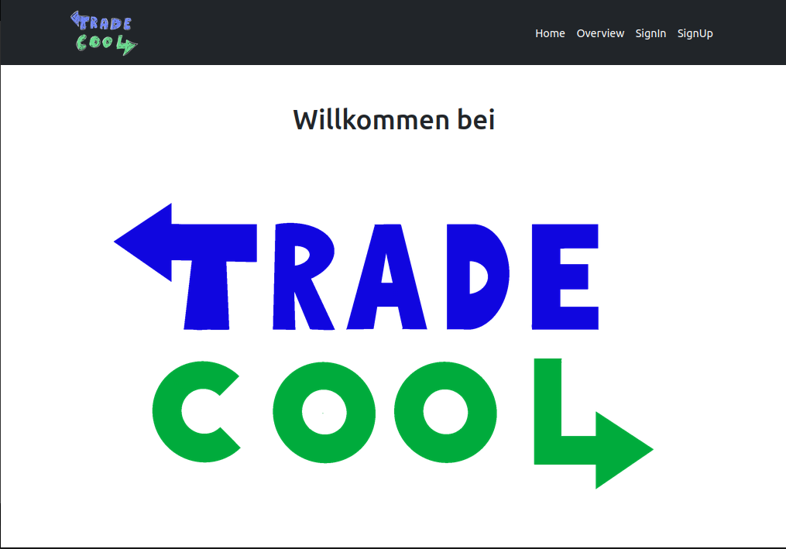
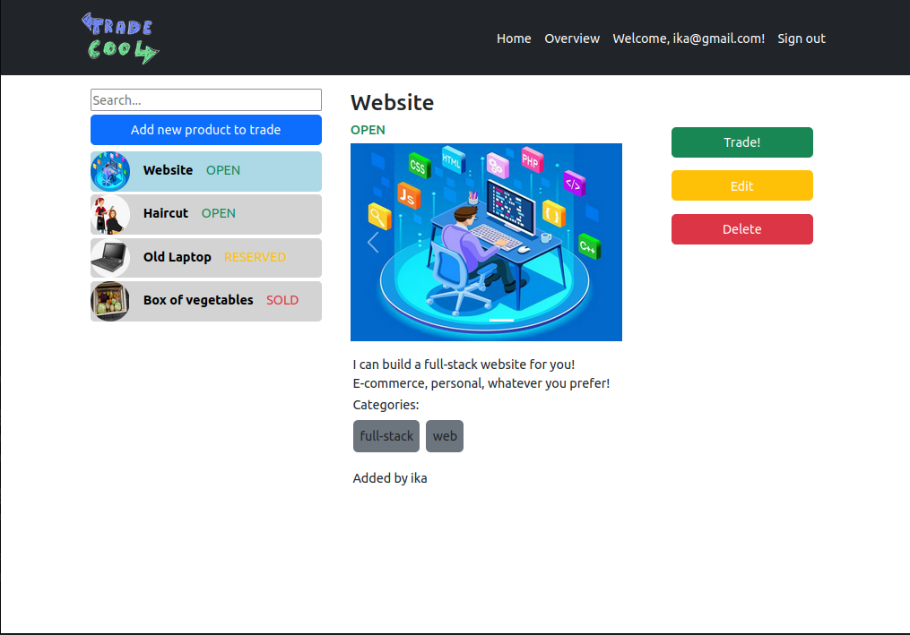

# TradeCool

A platform to exchange goods, products and services. You can login and start trading! What is special about our website? Trading does not necessarily require money, just a product or service in return!


## Tech Stack

**Frontend:** React, Bootstrap

**Backend:** Spring

**Database:** Postgres
## Run Locally

Clone the project

```bash
  git clone https://github.com/luk4skoch/TradeCool
```

Go to the project directory

```bash
  cd TradeCool
```

### Frontend

Install dependencies

```bash
  cd frontend/Tradecool
  npm install
```

Start react on port 3000.

```bash
  npm start
```

### Backend

Add your database name, user and password to the application.yml file. Then run with Maven:

```bash
  cd backend/tauschcool
  mvn spring-boot:run
```

It will start the server on port 8080.

In the future, this app will be dockerized. 

### Screenshots




## Authors

- [@AmiDevVienna](https://www.github.com/AmiDevVienna)
- [@IkaPata](https://www.github.com/IkaPata)
- [@luk4skoch](https://www.github.com/luk4skoch)


## Roadmap

- [x]  Setup project
- [x]  Add / edit / delete products
- [x]  Add / edit / delete products with images
- [x]  Add chat
- [x]  Add Spring Security and Users Login, Logout
- [x]  Use JWT
- [ ]  Add tests
- [ ]  Dockerize
